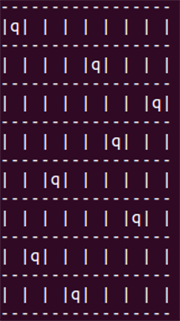

# Queens Program

This program solves the problem of placing eight queens on a 8x8 chessboard such that no queen can capture any other queens (known as the eight queens puzzle, published by chess composer Max Bezzel in 1848). The program finds a way to place queens on the chessboard such that there is only one queen on each row, column and diagonal. This is the output when running this program from Terminal:

 

 

### Checking row, column and diagonal

The methods isRowClear and isColClear loop through columns and rows, respectively, and return true if there is no queen in a row or column. The method isDiagonalClear first checks if a move is out of bounds of the chessboard. If true, it stops checking since it already reaches the border. If false, it proceeds to loop through and check the diagonal lines in four directions.

### Placing queen recursively

After all checks are cleared, method placeQueens puts a queen at a position. It then calls itself recursively, passing the next row. If the recursive call returns true, a queen has been successfully placed in the current row, and because of the recursion, queens have also been placed in all subsequent rows of the board. The solution is found. 

If the recursive call returns false, it means that at some point, it is not possible to place more queens given the position of the already placed queens. In this case, the function erases the current arrangment, backtracks to the first queen, places it at the next legal column and tries the recursion again.

This program has both Java and C versions: [Queens.java](https://github.com/vantrinh7/QueensProgram/blob/master/src/Queens.java) and [Queens.c](https://github.com/vantrinh7/QueensProgram/blob/master/queens.c)
